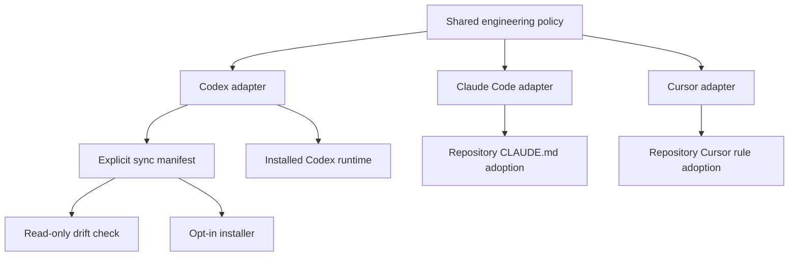

# Cross-Surface Engineering Workflow - Plan

## Goal Capsule

- **Objective:** Make this repository the canonical, reviewable source for a consistent engineering lifecycle across Codex, Claude Code, and Cursor.
- **Authority:** The vendor-neutral policy owns lifecycle semantics; surface adapters translate it without weakening role, safety, verification, or authorization boundaries.
- **Execution profile:** Add declarative configuration, documentation, and deterministic shell checks. Do not mutate installed user configuration as part of this change.
- **Stop conditions:** Stop for secrets, credentials, machine state, ambiguous destructive installation behavior, or a surface adapter that cannot preserve the core policy.
- **Tail ownership:** Sol integrates, verifies, reviews, and creates the authorized commit.

---

## Product Contract

### Summary

This repository will hold the portable engineering policy and the configuration needed to apply it consistently across Codex, Claude Code, and Cursor. Installed home-directory files become deployments of the repository source rather than independent sources of truth.

### Problem Frame

The repository currently documents the operating model but does not track the Codex files that enforce it. The 23 July named-agent routing fix changed the installed skill without changing Git, proving that documentation and runtime behavior can drift. Claude Code and Cursor have no equivalent canonical adapters here.

### Requirements

**Canonical policy**

- R1. The repository defines one vendor-neutral CE + Sol/Luna lifecycle and names the invariants every surface must preserve.
- R2. Surface-specific files cite the shared policy and translate it into native instruction formats without duplicating unnecessary rationale.

**Codex**

- R3. Git tracks the Luna maker and reviewer definitions, the `ce-luna-engineering` skill, worker-packet contract, and a safe runtime configuration fragment.
- R4. Codex dispatch uses named `luna_maker` and `luna_reviewer` agents with no-history forks and no generic-agent fallback.

**Claude Code and Cursor**

- R5. Git provides adoptable Claude Code and Cursor instruction adapters that preserve Sol ownership, bounded implementation, independent review, verification, and external-write authorization.
- R6. Adapters avoid claiming unsupported model-routing or sandbox guarantees.

**Operations**

- R7. Documentation identifies what is canonical, generated or installed, machine-local, and secret.
- R8. A deterministic drift check compares the tracked Codex sources with installed files without changing them.
- R9. Installation is explicit, scoped, reviewable, and never copies credentials, state databases, caches, histories, or complete personal configuration files.

### Scope Boundaries

- In scope: the shared policy, three surface adapters, Codex agent and skill sources, safe configuration examples, drift/install tooling, operating documentation, and this decision record.
- Out of scope: authenticating tools, installing Compound Engineering itself, modifying current home-directory configuration during this commit, synchronizing project-specific domain rules, and promising identical runtime capabilities where surfaces differ.

---

## Planning Contract

### Key Technical Decisions

- KTD1. **Git is canonical; home-directory files are deployments.** This prevents unreviewed runtime edits from becoming the only copy of an engineering control.
- KTD2. **Separate policy from adapters.** The shared lifecycle is vendor-neutral while each surface records only its native invocation and enforcement mechanics.
- KTD3. **Track safe fragments, not full personal configuration.** Complete runtime files may contain credentials, machine paths, trust settings, connectors, caches, or unrelated preferences.
- KTD4. **Use a manifest-backed Codex sync boundary.** Drift and installation scripts operate only on an explicit allowlist of repository-to-home paths.
- KTD5. **Do not fake parity.** Claude Code and Cursor adapters preserve behavioral invariants while documenting capabilities that remain surface-specific.

### Assumptions

- The intended surfaces are Codex, Claude Code, and Cursor.
- Bash-compatible tooling is acceptable for local drift and installation checks.
- The existing public repository remains suitable for these shareable, non-secret files.

### High-Level Technical Design

---

## Implementation Units

### U1. Canonical policy and decision record

- **Goal:** Establish the source-of-truth model and cross-surface invariants.
- **Requirements:** R1, R2, R7, R9
- **Dependencies:** None
- **Files:** `policy/engineering-lifecycle.md`, `docs/decisions/0001-canonical-cross-surface-workflow.md`, `docs/operating-guide.md`
- **Approach:** Define canonical versus installed versus local state, role boundaries, adoption flow, and exclusions.
- **Test scenarios:** Documentation links resolve; prohibited secret and state paths are explicitly excluded.
- **Verification:** A reader can determine where to change policy and how changes reach each surface.

### U2. Codex source adapter

- **Goal:** Version the files that enforce the current Codex workflow.
- **Requirements:** R2, R3, R4, R9
- **Dependencies:** U1
- **Files:** `surfaces/codex/AGENTS.fragment.md`, `surfaces/codex/config.fragment.toml`, `surfaces/codex/agents/luna-maker.toml`, `surfaces/codex/agents/luna-reviewer.toml`, `surfaces/codex/skills/ce-luna-engineering/SKILL.md`, `surfaces/codex/skills/ce-luna-engineering/agents/openai.yaml`, `surfaces/codex/skills/ce-luna-engineering/references/worker-packets.md`
- **Approach:** Copy the reviewed installed agent and skill definitions, then keep personal and machine-specific settings out of the tracked fragment.
- **Execution note:** Prefer content comparison against the installed files over relying on timestamps.
- **Test scenarios:** Named maker/reviewer routes, effort levels, sandboxes, no-history forks, routing records, and stop-on-unavailable behavior remain present.
- **Verification:** Tracked Codex behavior matches the installed 23 July workflow without tracking unrelated personal configuration.

### U3. Claude Code and Cursor adapters

- **Goal:** Provide native instruction files that preserve the portable lifecycle.
- **Requirements:** R2, R5, R6
- **Dependencies:** U1
- **Files:** `surfaces/claude-code/CLAUDE.fragment.md`, `surfaces/cursor/engineering-workflow.mdc`
- **Approach:** Express common role and evidence rules while marking Codex-only routing details as non-portable.
- **Test scenarios:** Each adapter keeps lead-owned decisions, bounded maker scope, independent review, final verification, and explicit authorization for external writes.
- **Verification:** Neither adapter claims a model, sandbox, or agent type its surface cannot guarantee.

### U4. Drift and installation tooling

- **Goal:** Make divergence visible and deployment deliberate.
- **Requirements:** R7, R8, R9
- **Dependencies:** U2
- **Files:** `manifest/codex-files.tsv`, `scripts/check-codex-drift.sh`, `scripts/install-codex.sh`
- **Approach:** Use an explicit path manifest; default to read-only comparison; require an apply flag before writes; create recoverable backups of overwritten tracked targets.
- **Execution note:** Smoke-test against temporary directories, never the active home configuration.
- **Test scenarios:** Clean mirror returns success; missing and changed targets return non-zero with clear paths; dry-run installation changes nothing; apply installation creates expected files and backups in a temporary target.
- **Verification:** Shell syntax and temporary-directory smoke tests pass without touching `~/.codex`.

### U5. Repository entrypoint

- **Goal:** Make the canonical layout discoverable from the existing README.
- **Requirements:** R1, R7, R9
- **Dependencies:** U1, U2, U3, U4
- **Files:** `README.md`, `CONTRIBUTING.md`
- **Approach:** Link the policy, adapters, operating guide, decision record, and safe update workflow.
- **Test scenarios:** Referenced files exist and contribution guidance requires adapter updates and drift validation when shared behavior changes.
- **Verification:** A new contributor can locate the authority hierarchy and update path from the repository root.

---

## Verification Contract

| Gate | Applies to | Done signal |
|---|---|---|
| Repository scope | All units | `git status --short` contains only planned files |
| Shell syntax | U4 | Both scripts pass `bash -n` |
| Drift smoke | U4 | A temporary installed tree passes when equal and fails when changed |
| Install smoke | U4 | Dry run is inert; apply populates only manifest targets in a temporary root |
| Content parity | U2 | Tracked Codex agent and skill sources match the intended installed sources |
| Link and policy review | U1, U3, U5 | Referenced paths exist and adapters preserve all shared invariants |

---

## Definition of Done

- The repository contains a canonical policy and documented authority hierarchy.
- Codex enforcement files, including the 23 July routing fix, are committed as source.
- Claude Code and Cursor adapters are present without unsupported capability claims.
- Drift and installation scripts operate only on an explicit allowlist and pass temporary-directory smoke tests.
- README and contribution guidance explain the change workflow.
- No credentials, caches, histories, databases, machine trust settings, or unrelated user configuration are added.
- The final diff contains no abandoned or experimental files.
