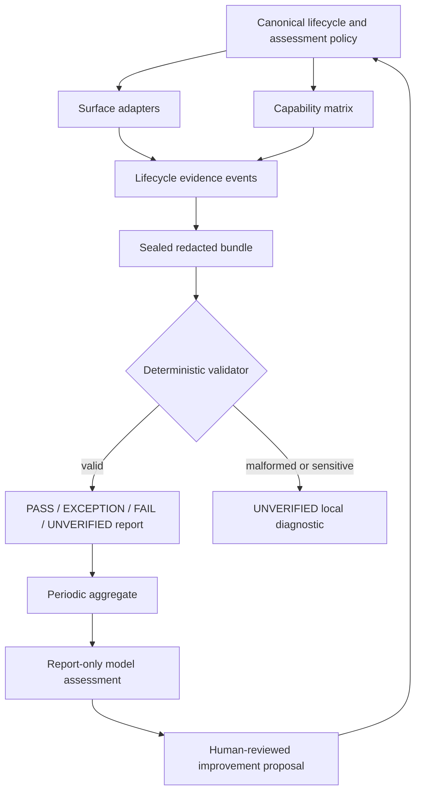

# Engineering Workflow Assessment - Plan

## Goal Capsule

- **Objective:** Add a portable, privacy-minimising assessment capability that makes substantive CE + Sol/Luna coding runs demonstrably aligned with the canonical lifecycle and produces evidence-backed framework-improvement recommendations.
- **Authority:** `policy/engineering-lifecycle.md` remains the source of truth for lifecycle semantics; the new assessment policy owns evidence, conformance, and evaluation semantics. Sol retains acceptance and every approval-bearing decision.
- **Execution profile:** Add Git-tracked policy, schemas, fixtures, dependency-free scripts, a Codex assessment skill, surface adapters, and CI. Do not inspect active home configuration, capture raw conversations or source, or automate policy/deployment changes.
- **Stop conditions:** Stop a run from becoming `PASS` when evidence is malformed, sensitive, stale, tampered, incomplete, or claims a host capability that cannot be established. Record these cases as `UNVERIFIED`; do not infer compliance.
- **Tail ownership:** Sol integrates, verifies, reviews, and accepts the implementation. Model-assisted assessment remains advisory and has no write, approval, or delivery authority.

---

## Product Contract

### Summary

This plan adds a canonical assessment contract and portable evidence pipeline around the existing workflow gates. Every substantive, instrumented coding run will produce a sealed, redacted lifecycle-evidence bundle that a deterministic validator evaluates before an optional report-only assessor identifies workflow improvements.

### Problem Frame

The existing lifecycle requires scope, control, independence, verification, and delivery gates, but its evidence is primarily conversational and has no stable schema, capability model, or conformance result. This makes it impossible to compare deployments honestly, distinguish configured from observed runtime behavior, or learn from developer/model interactions without collecting unsafe transcripts.

### Requirements

**Canonical assessment contract**

- R1. Define substantive coding activity and require each instrumented run to emit a versioned, repository-scoped evidence bundle with a correlation ID.
- R2. Represent lifecycle conformance as an immutable state machine: `COLLECTING → SEALED → VALIDATED → PASS | EXCEPTION | FAIL | UNVERIFIED`.
- R3. Keep conformance separate from Sol acceptance, delivery authorization, release, and policy change approval.
- R4. Record requested, configured, observed, and unknown routing facts separately; absence of host metadata must remain unknown rather than becoming a claim.

**Integrity and privacy**

- R5. Bind each bundle to policy and adapter versions, ordered lifecycle events, declared surface capabilities, review base/target identities, and integrity digests for permitted artifacts.
- R6. Apply a fail-closed allowlist that excludes raw prompts, transcripts, diffs, source, absolute paths, environment values, credentials, personal configuration, connector data, histories, caches, and databases.
- R7. Require exceptions to be explicit, run-scoped, time-bounded, approver-attributed, and visible alongside the underlying failed or unverified control; an exception never rewrites that underlying result to `PASS`.

**Cross-surface assessment and improvement**

- R8. Publish a capability matrix that classifies every lifecycle control per surface as `enforced`, `observed`, `attested`, or `unsupported`, with compensating evidence where applicable.
- R9. Validate evidence deterministically before any model-assisted assessment and report `UNVERIFIED` for unsupported or unprovable required controls.
- R10. Provide a report-only assessment skill that consumes sealed, redacted evidence and emits cited, confidence-qualified recommendations without changing policy, deployments, approvals, or delivery state.
- R11. Ensure every shared-policy change updates affected adapters, documentation, schemas, fixtures, and CI checks together.

### Scope Boundaries

- **In scope:** canonical assessment policy; a surface-neutral evidence and capability contract; fixtures; Bash validation and aggregation; a Codex assessment skill; existing CE closeout capture; portable adapter wording; CI; safe Codex installation/drift coverage; documentation and rollout guidance.
- **Deferred to follow-up work:** centralized telemetry storage, organization-wide dashboards, retention administration, raw or redacted transcript sampling, automated model-cost collection, and cross-vendor event ingestion.
- **Outside this product's identity:** universal host enforcement, inferred model identity, automatic approval of exceptions, autonomous framework edits, direct production/release actions, and copying personal runtime configuration into Git.

### Acceptance Examples

- AE1. A Codex maker/reviewer run with complete, matching evidence transitions to `PASS`, while Sol acceptance remains a separate recorded decision.
- AE2. A Cursor run that lacks evidence for named-agent routing is `UNVERIFIED` for that required control rather than being treated as compliant because its rule file exists.
- AE3. A bundle containing an absolute path, raw command output, unknown schema version, duplicated event sequence, or mismatched digest is rejected before aggregation and receives no model assessment.
- AE4. A lead-approved exception retains the original `FAIL` or `UNVERIFIED` result, references a bounded waiver, and expires instead of transferring to a later run.
- AE5. A periodic assessment recommendation cites only sealed bundle control IDs and confidence, then routes any adopted change through the ordinary policy-first contribution path.

---

## Planning Contract

### Key Technical Decisions

- KTD1. **Make evidence bundles the portable control plane.** Use a versioned, line-oriented, allowlisted record format that Bash can validate without package installation; retain digests and repository-relative artifact references rather than raw interaction content. This follows the repository's dependency-free shell and explicit-manifest posture.
- KTD2. **Use a conformance state machine with typed capability evidence.** `PASS`, `EXCEPTION`, `FAIL`, and `UNVERIFIED` are validator outcomes, not a quality score or acceptance decision. The capability matrix prevents Codex-only enforcement from becoming an unsupported cross-surface promise.
- KTD3. **Seal before assessment.** The validator verifies event ordering, run binding, policy/adapter references, permitted fields, and integrity digests before aggregation. It treats malformed, stale, substituted, or incomplete evidence as `UNVERIFIED` and blocks model evaluation of that bundle.
- KTD4. **Keep model evaluation advisory and bounded.** `ce-assess-engineering` receives only validated redacted summaries, uses Sol high for periodic synthesis and Luna high only for optional routine rubric classification, and can draft recommendations but cannot authorize or mutate anything.
- KTD5. **Install only complete Codex skill files through the existing manifest.** Preserve manual merge semantics for `AGENTS.md` and `config.toml`; do not expand the installer into a broad sync mechanism.
- KTD6. **Ship the foundation before recurring analytics.** Start with local post-run validation and fixture-backed CI. Add scheduling only after deployments can produce valid bundles and the capability matrix exposes coverage gaps honestly.

### High-Level Technical Design

The evidence pipeline is deliberately one-way: neither the validator nor the assessor can accept a change, deploy an adapter, or alter a lifecycle decision.

### Assumptions

- Git metadata and a SHA-256-compatible digest utility are available in supported environments; the validator will report unsupported integrity tooling rather than substitute a weaker check.
- The first release is local/repository-scoped. A CI workflow validates framework artifacts and fixtures but does not upload run evidence or inspect user home directories.
- Host runtime metadata varies by surface. The capability matrix, not adapter prose, determines whether a control can become `PASS`.

### System-Wide Impact

The capability changes the meaning of "evidence" across policy, maker/reviewer packets, Codex closeout, adapters, installation, and contribution checks. It adds a durable privacy boundary and makes deployment quality inspectable, but it must never weaken the current Sol ownership, independent review, or external-write authorization controls.

### Risks and Dependencies

- **Evidence laundering:** replayed or mixed records could look compliant. Mitigate with run-bound IDs, event sequence, policy/adapter identities, digests, sealing, and fixture coverage for mismatch cases.
- **Telemetry overreach:** interaction data could leak sensitive content. Mitigate with an allowlist, redaction before sealing, local-only diagnostics, ignored runtime output directories, and fail-closed validation.
- **False parity:** non-Codex hosts may not expose required facts. Mitigate with capability states and `UNVERIFIED`, never an inferred `PASS`.
- **Workflow friction:** mandatory capture can be bypassed or become ceremony. Mitigate by limiting initial capture to substantive runs, keeping records concise, and reporting coverage rather than silently assuming universal instrumentation.
- **Evaluator authority creep:** recommendations could be mistaken for decisions. Mitigate with report-only skill boundaries, cited evidence, human approval records, and the existing policy-first update path.

### Sources and Research

- `policy/engineering-lifecycle.md` defines the lifecycle invariants and canonical-versus-local privacy boundary.
- `surfaces/codex/skills/ce-luna-engineering/SKILL.md` already distinguishes requested, configured, and observed routes and requires stable review lanes.
- `surfaces/codex/skills/ce-luna-engineering/references/worker-packets.md` provides the capture checkpoints that the evidence contract will formalize.
- `scripts/check-codex-drift.sh` and `scripts/install-codex.sh` demonstrate the repository's explicit allowlist, safe-root, symlink-rejection, dry-run, and backup conventions.
- No `docs/solutions/` corpus exists. External research tools were not available in this environment; privacy and integrity decisions are therefore bounded by the repository's existing safety contract and must remain reviewable.

---

## Implementation Units

### U1. Canonical assessment policy and decision record

- **Goal:** Establish portable assessment semantics without changing lifecycle ownership or claiming host enforcement that does not exist.
- **Requirements:** R1, R2, R3, R5, R6, R7, R8, R11; Covers AE1, AE2, AE4, AE5.
- **Dependencies:** None.
- **Files:** `policy/engineering-assessment.md`, `policy/engineering-lifecycle.md`, `docs/decisions/0002-engineering-workflow-assessment.md`.
- **Approach:** Define substantive-run eligibility, the conformance state machine, evidence sealing, the field/privacy allowlist, exception object semantics, result meaning, model-assessment authority boundary, and the per-surface capability vocabulary. Link the lifecycle policy to the assessment policy rather than duplicating rules.
- **Patterns to follow:** `policy/engineering-lifecycle.md`; `docs/decisions/0001-canonical-cross-surface-workflow.md`.
- **Test scenarios:**
  - A required control with no supported or attested evidence resolves to `UNVERIFIED`, not `PASS`.
  - A lead-owned exception has a reason, approver, scope, expiry, and underlying result, and cannot convert a failed control into `PASS`.
  - A policy change leaves Sol acceptance and delivery authorization outside validator authority.
- **Verification:** The policy identifies one owner for each normative assessment rule and the decision record explains the state-machine, privacy, and capability trade-offs.

### U2. Portable evidence schema, capability matrix, and safe fixtures

- **Goal:** Define the machine-readable, dependency-free assessment inputs and representative invalid cases.
- **Requirements:** R1, R4, R5, R6, R7, R8, R9; Covers AE1, AE2, AE3, AE4.
- **Dependencies:** U1.
- **Files:** `assessment/schema/run-events-v1.tsv`, `assessment/schema/capability-matrix-v1.tsv`, `assessment/fixtures/valid-codex-run/`, `assessment/fixtures/unsupported-cursor-control/`, `assessment/fixtures/invalid-sensitive-field/`, `assessment/fixtures/invalid-integrity/`, `assessment/.gitignore`.
- **Approach:** Specify fixed columns, allowed enums, required event ordering, run and policy bindings, actor/route evidence fields, bounded result summaries, approved-exception references, and integrity metadata. Define control rows per Codex, Claude Code, Cursor, and CI as `enforced`, `observed`, `attested`, or `unsupported`; ignore generated evidence and reports while keeping schemas and fixtures tracked.
- **Patterns to follow:** `manifest/codex-files.tsv` for strict line-oriented input; `policy/engineering-lifecycle.md` for excluded data classes.
- **Test scenarios:**
  - A valid Codex fixture includes separate requested, configured, and observed route values and completes the required lifecycle order.
  - A Cursor fixture marks named-agent routing unsupported and cannot satisfy that control from adapter presence alone.
  - Fixtures containing absolute paths, raw output, unapproved columns, duplicate event sequence, unknown schema, or cross-run hash references are rejected.
- **Verification:** Every fixture contains only allowlisted fields and demonstrates one expected validator outcome.

### U3. Deterministic validator and local conformance report

- **Goal:** Validate sealed evidence and produce a machine-readable plus human-readable conformance result without external dependencies.
- **Requirements:** R2, R4, R5, R6, R7, R8, R9; Covers AE1, AE2, AE3, AE4.
- **Dependencies:** U1, U2.
- **Files:** `scripts/validate-assessment.sh`, `scripts/test-assessment.sh`, `assessment/reports/.gitkeep`.
- **Approach:** Follow the existing safe-shell style to accept only an explicit bundle path, reject unsafe paths and symbolic-link traversal, validate schema and capability references, calculate/check permitted digests, enforce monotonic event transitions, and emit distinct control-level and run-level outcomes. Keep sensitive diagnostics local and omit them from generated reports.
- **Execution note:** Start with fixtures that fail for each invariant before completing the successful bundle path.
- **Patterns to follow:** `scripts/check-codex-drift.sh`, `scripts/install-codex.sh`.
- **Test scenarios:**
  - A complete sealed fixture produces `PASS` controls and a separate non-acceptance conformance summary.
  - A missing review lane, reviewer-write event, scope/control escalation, policy mismatch, stale expiry, tampered digest, or impossible transition cannot produce `PASS`.
  - An approved exception is reported with its original result and expiry.
  - A malformed path, symbolic-link component, unsupported digest utility, or detected sensitive field fails closed as `UNVERIFIED` without echoing its value.
- **Verification:** `bash -n` passes for assessment scripts and fixture-based temporary-directory tests cover every terminal result plus rejected-input paths.

### U4. CE closeout capture and Codex assessment skill

- **Goal:** Make substantive Codex runs produce and assess the standard evidence bundle while keeping evaluation advisory.
- **Requirements:** R1, R3, R4, R6, R9, R10; Covers AE1, AE3, AE5.
- **Dependencies:** U1, U2, U3.
- **Files:** `surfaces/codex/skills/ce-luna-engineering/SKILL.md`, `surfaces/codex/skills/ce-luna-engineering/references/worker-packets.md`, `surfaces/codex/skills/ce-assess-engineering/SKILL.md`, `surfaces/codex/skills/ce-assess-engineering/agents/openai.yaml`.
- **Approach:** Extend existing packet, integration, review, synthesis, and closeout checkpoints to record the minimal lifecycle events. Add `ce-assess-engineering` modes for a completed run, a periodic aggregate, and a deep audit; require sealed validator output; limit inputs to redacted summaries; require citations and confidence; prohibit edits, acceptance, authorization, installation, deployment, and policy mutation.
- **Patterns to follow:** Existing routing-record and pre/post-review worktree checks in `surfaces/codex/skills/ce-luna-engineering/SKILL.md`; `openai.yaml` interface metadata.
- **Test scenarios:**
  - A maker/reviewer run records only eligible fields and links its stable baseline, review result, Sol verification, and acceptance decision without treating acceptance as validator output.
  - An assessment invoked with an unsealed or invalid bundle stops before model evaluation.
  - A periodic report cites control IDs and confidence, proposes a change, and does not alter a policy, adapter, manifest, or delivery state.
- **Verification:** Manual dry-run walkthrough confirms the CE skill can produce a complete fixture-shaped record and the assessment skill is report-only by instruction and available tooling.

### U5. Adapter parity, deployment checks, and CI

- **Goal:** Keep canonical assessment semantics synchronized across surfaces without inventing runtime parity.
- **Requirements:** R8, R9, R11; Covers AE2, AE5.
- **Dependencies:** U1, U2, U3, U4.
- **Files:** `surfaces/codex/AGENTS.fragment.md`, `surfaces/claude-code/CLAUDE.fragment.md`, `surfaces/cursor/engineering-workflow.mdc`, `manifest/codex-files.tsv`, `.github/workflows/assessment-conformance.yml`, `scripts/check-assessment-adapters.sh`.
- **Approach:** Add compact adapter instructions to emit or attach evidence only when the host can do so, declare capability limitations explicitly, and point users to the canonical policy. Add complete Codex assessment skill files to the manifest. Implement a static adapter checker for required policy links, invariant identifiers, prohibited guarantee language, capability rows, manifest coverage, and enabled/loaded-state documentation; CI runs the checker and fixture tests without accessing an active home directory.
- **Patterns to follow:** Manual fragment merge boundary in `docs/operating-guide.md`; manifest-only installer boundary in `scripts/install-codex.sh`.
- **Test scenarios:**
  - A changed or missing manifest target is detected by existing drift behavior after the new skill is listed.
  - A Claude/Cursor adapter that claims named routing, read-only sandboxing, or approval enforcement fails the static check.
  - A Cursor rule with no activation evidence and a copied Claude fragment with an invalid relative link are classified as not loaded/documentation-only until remediated.
  - CI passes on the canonical matrix and fails when an adapter omits a required invariant or capability declaration.
- **Verification:** Temporary `CODEX_ROOT` smoke tests preserve dry-run, scoped install, and backup behavior; CI writes only generated conformance artifacts.

### U6. Operating guidance, contribution workflow, and staged adoption

- **Goal:** Make the assessment capability understandable and safely deployable without turning it into surveillance or a second lifecycle.
- **Requirements:** R3, R6, R7, R10, R11; Covers AE3, AE4, AE5.
- **Dependencies:** U1, U2, U3, U4, U5.
- **Files:** `README.md`, `CONTRIBUTING.md`, `docs/operating-guide.md`, `docs/decisions/0001-canonical-cross-surface-workflow.md`.
- **Approach:** Document bundle eligibility, privacy boundaries, capability matrix interpretation, exception review, deployment receipts and rollback to a prior tracked version, model-evaluation limits, report cadence, and policy-first change control. Stage adoption as fixture/CI foundation, Codex pilot, capability coverage review, then explicitly authorized scheduled aggregates.
- **Patterns to follow:** Existing canonical-versus-deployment guidance and temporary-root testing requirements.
- **Test scenarios:**
  - A contributor can locate the policy owner, schema, validator, surface capability result, and exception process from the README.
  - Deployment guidance never asks a user to copy home state, credentials, histories, connectors, or personal configuration into the repository.
  - Rollback restores a previous tracked deployment or manifest backup and records the assessment-version change.
- **Verification:** Documentation links resolve, contribution guidance names assessment checks, and policy-related change instructions list every affected surface and test gate.

---

## Verification Contract

| Gate | Applies to | Done signal |
| --- | --- | --- |
| Policy and schema review | U1-U2 | Every control, result state, field class, and exception rule has one canonical owner and stable ID. |
| Shell syntax | U3, U5 | `bash -n` succeeds for all new and changed scripts. |
| Fixture validation | U2-U3 | Valid, exception, failure, unsupported, sensitive, stale, tampered, and malformed fixtures produce the specified outcomes. |
| Privacy rejection | U2-U4 | Disallowed field classes never appear in sealed bundles or generated reports; validator diagnostics do not reveal rejected values. |
| Codex temporary-root smoke | U4-U5 | Manifest drift/install checks include the assessment skill and make no change outside a temporary `CODEX_ROOT`. |
| Adapter conformance | U5 | Each policy invariant has a capability declaration; adapters retain their truthful host limitations and valid adoption/activation guidance. |
| CI isolation | U5 | CI validates tracked artifacts and fixtures only; it reads no active home configuration and uploads no run evidence. |
| Documentation review | U6 | Policy, adapters, README, operating guide, contribution guide, and ADR agree on ownership, privacy, and rollout. |

---

## Definition of Done

- The repository has a canonical assessment policy, decision record, schema, and capability matrix that preserve current lifecycle ownership.
- A substantive Codex run can emit a sealed, redacted, fixture-compatible evidence bundle and receive a deterministic conformance result.
- All terminal states, including `UNVERIFIED` and exception expiry, are covered by fixture-based tests; no state implies Sol acceptance or delivery authorization.
- Codex, Claude Code, Cursor, and CI capability limits are explicit, and unsupported claims cannot pass adapter conformance.
- The assessment skill can generate report-only, cited recommendations from validated evidence and cannot mutate workflow policy or deployment state.
- The new complete Codex skill files are manifest-covered; install/drift tests use only a temporary deployment root.
- Documentation explains privacy, exceptions, capability gaps, adoption, rollback, and the policy-first change path.
- No collected evidence, generated report, credentials, personal configuration, machine path, connector detail, raw interaction content, or abandoned implementation artifact is committed.
