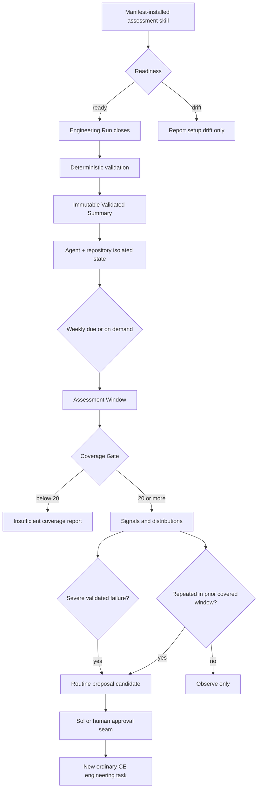

# Isolated Assessment Cadence - Plan

## Goal Capsule

- **Objective:** Install the same self-contained assessment runtime into every Codex agent while keeping each agent's evidence, analysis, cadence, and reports isolated.
- **Authority:** Canonical policy and schemas remain Git-tracked. Sol retains delivery acceptance and approval of every Improvement Proposal.
- **Execution profile:** Deepen deterministic validation, add isolated local Assessment Window state, install all required runtime resources through the explicit manifest, and run a report-only weekly due check after delivery closeout.
- **Stop conditions:** Stop if setup would share state across agent identities, inspect another agent's records, widen the evidence allowlist, depend on active personal configuration, or let assessment affect acceptance or mutate policy.
- **Tail ownership:** Sol integrates and accepts. An independent Luna reviewer checks privacy, path safety, isolation, compatibility, and scope.

---

## Product Contract

### Summary

Each Codex agent receives the same versioned assessment implementation and defaults, but operates on its own local state.
A substantive Engineering Run may create one immutable Validated Summary.
Once per completed calendar week, or on demand, the agent evaluates only its own summaries and produces a report-only Assessment Window result.

### Problem Frame

The current installed `ce-assess-engineering` skill contains instructions but not the policy, schemas, adapters, validator, or aggregation implementation it names.
Periodic assessment is therefore prose-only and setup can differ silently between agents.
A shared repository state would add coordination and privacy complexity that the user explicitly does not need.

### Requirements

**Consistent installation**

- R1. Every installed Codex assessment skill contains the same manifest-tracked policy, schemas, adapter references, validator, window implementation, and readiness behavior.
- R2. Setup is idempotent and reports missing, changed, unsafe, or incompatible runtime resources as setup drift.
- R3. Existing validator and installer commands remain compatible for contributors and temporary-root tests.

**Isolated local state**

- R4. Each agent uses an explicit bounded agent identifier and repository identifier; summaries and reports from one identity are never read by another.
- R5. Persist only privacy-minimised Validated Summaries and generated reports under the selected Codex root; never persist bundles, prompts, transcripts, source, diffs, absolute repository paths, environment values, credentials, or personal configuration.
- R6. Local writes use a per-state lock plus atomic replacement, refuse symbolic-link traversal, and never write outside the resolved agent/repository state root.

**Cadence and improvement**

- R7. A normal Assessment Window covers one completed UTC ISO week, requires at least 20 distinct Validated Summaries, and retains no more than the latest 13 completed windows locally.
- R8. A routine signal becomes eligible for an Improvement Proposal only when the same evidence-backed signal appears in two consecutive sufficiently covered windows.
- R9. A severe validated conformance failure may surface immediately as a proposal candidate, including below the Coverage Gate, but never changes delivery state.
- R10. On-demand assessment may inspect a partial current week but cannot persist a closed report, establish a Recurring Signal, or participate in retention.
- R11. The cadence check runs after delivery closeout, is idempotent for a window, and cannot delay, reverse, or replace Sol acceptance.
- R12. No report or proposal is shared across agents, centrally uploaded, or applied automatically.
- R13. Closed windows are immutable; a summary validated after closure belongs to the open ingestion window and never rewrites historical coverage or recurrence.

### Acceptance Examples

- AE1. Two agent identifiers using the same temporary Codex root ingest different bundles and each assessment sees only its own summaries.
- AE2. Repeating setup with the same identifiers and version produces the same ready state without replacing unrelated Codex configuration.
- AE3. Twenty valid summaries in a completed week produce a covered report; nineteen produce an insufficient-coverage report with no routine proposal candidate.
- AE4. The same routine signal in two consecutive covered windows becomes eligible in the second window; a partial on-demand window does not contribute to recurrence.
- AE5. A validated `FAIL` surfaces immediately as a severe proposal candidate but does not become `PASS`, acceptance, authorization, or a policy edit.
- AE6. Re-running the same weekly due check produces one logical window result and preserves immutable summaries.
- AE7. A symlinked state path, malformed identifier, invalid summary, cross-agent path, or uninstalled runtime fails closed without exposing rejected content.
- AE8. Concurrent sessions for one agent serialize ingestion and closure without losing summaries or producing divergent reports.
- AE9. A late-arriving bundle validated after a week closes enters the current open window and leaves the closed report unchanged.

### Scope Boundaries

- **In scope:** self-contained Codex assessment installation; deterministic structured summaries; isolated per-agent/per-repository local state; weekly and on-demand windows; Coverage Gate, retention, recurrence, and severe-failure rules; readiness, fixture tests, CI, and operating guidance.
- **Deferred to follow-up work:** OS-specific scheduler registration, dashboards, organization-wide aggregation, signed capture, remote storage, cost analytics, and cross-vendor ingestion.
- **Outside this product's identity:** shared agent records, central telemetry, raw interaction sampling, autonomous policy edits, automatic acceptance, and assessment inside delivery decision-making.

---

## Planning Contract

### Key Technical Decisions

- KTD1. **Isolate by explicit agent and repository identity.** `(session-settled: user-directed — chosen over shared repository state: agents need consistent setup, not shared records or analysis.)` State lives under the selected Codex root in an agent/repository namespace and is accessed only through the assessment runtime. Governs R4-R6 and R12.
- KTD2. **Install a self-contained assessment runtime.** Manifest targets place canonical policy, schemas, adapter references, and executable mechanics beneath the installed `ce-assess-engineering` skill. Runtime behavior must not depend on the source repository remaining present. Governs R1-R3.
- KTD3. **Make validation own the structured summary.** Deterministic validation produces the privacy-minimised summary consumed by run audit and Assessment Windows; model-assisted assessment never reconstructs facts from bundles. Governs R3, R5, R7-R10.
- KTD4. **Use completed UTC ISO weeks with fixed noise controls.** `(session-settled: user-approved — chosen over rolling windows and adaptive thresholds: approximately 30 weekly runs support a simpler stable cadence.)` The Coverage Gate is 20 summaries, retention is the latest 13 completed windows, routine eligibility requires two consecutive covered windows, and late validation never mutates a closed window. Governs R7-R10 and R13.
- KTD5. **Use a post-closeout due check instead of a scheduler framework.** The CE closeout invokes an idempotent report-only check after acceptance; setup and on-demand commands use the same implementation. Missing setup is reported as drift and never changes delivery outcome. Governs R2 and R11.
- KTD6. **Keep deterministic signals separate from Improvement Proposals.** The window implementation emits coverage, distributions, deterministic reason/severity codes, severe failures, and recurring proposal candidates. Routine recurrence is keyed by policy version, adapter version, surface, control, and reason so unlike deployments are not blended. `ce-assess-engineering` and Sol supply bounded qualitative judgment; no executable applies a proposal. Governs R8-R12.

### High-Level Technical Design

The evidence flow is one-way.
Delivery produces a Validated Summary, while the Assessment Window produces only reports and proposal candidates.

### Assumptions

- Supported Codex agents have Python 3 and standard-library filesystem primitives, matching the current validator prerequisite.
- Each setup supplies a bounded agent identifier and repository identifier rather than deriving identity from personal paths or configuration.
- The first active Engineering Run or explicit assessment invocation after UTC ISO-week closure may perform the weekly due check; exact wall-clock execution is deferred to an OS scheduler adapter when unattended scheduling is required.
- Generated local state is disposable and reproducible from future runs; it is never Git-canonical.

### System-Wide Impact

The manifest expands from installing instructions to installing the complete assessment runtime.
The validator gains a structured output contract while preserving its current terminal result behavior.
The CE closeout gains a separate post-acceptance due check.
Contributor tests must prove temporary-root isolation, installation completeness, privacy rejection, and cross-agent separation.

### Risks and Dependencies

- **Accidental state sharing:** defaults or derived paths could merge agents. Mitigate with required bounded identities, namespace checks, and two-agent isolation fixtures.
- **Policy/runtime drift:** an installed executable could disagree with canonical policy. Mitigate with manifest coverage, digests, readiness checks, and temporary-root drift tests.
- **Sensitive persistence:** summaries could preserve prohibited values. Mitigate by producing summaries only inside deterministic validation and testing the existing privacy rejection corpus.
- **Assessment authority creep:** cadence output could be mistaken for acceptance. Mitigate with post-closeout sequencing, distinct result language, deterministic severity rather than model-assigned severity, and no mutating action in the window implementation. Initial severe reasons are reviewer write, integrity mismatch, and unauthorized delivery, matching the canonical non-waivable controls.
- **Retention deletion scope:** pruning could escape local state. Mitigate with validated roots, no-follow traversal, bounded filenames, and tests that place sentinel files outside the state root.
- **Historical policy versions:** summaries must retain the policy and adapter digests validated at creation; windows segment rather than revalidate old summaries against current policy.

### Sources and Research

- `CONTEXT.md` defines Engineering Run, Evidence Bundle, Validated Summary, Assessment Window, Coverage Gate, Recurring Signal, and Improvement Proposal.
- `docs/decisions/0001-canonical-cross-surface-workflow.md` keeps runtime bundles and reports local and Git non-canonical.
- `docs/decisions/0002-engineering-workflow-assessment.md` requires sealed privacy-minimised evidence and report-only recommendations.
- `docs/plans/2026-07-24-002-feat-engineering-workflow-assessment-plan.md` explicitly deferred scheduling until valid bundles and honest coverage existed.
- `scripts/validate-assessment.sh` and `scripts/assessment_safe_open.py` contain the current conformance and no-follow behavior.
- `scripts/install-codex.sh`, `scripts/check-codex-drift.sh`, and `manifest/codex-files.tsv` provide explicit installation and safe-root patterns.
- `surfaces/codex/skills/ce-assess-engineering/SKILL.md` defines run, periodic, and deep audit semantics but is not currently self-contained when installed.

---

## Implementation Units

### U1. Extend canonical validation with summary production

- **Goal:** Make the existing canonical validator emit the privacy-minimised Validated Summary after its current conformance checks succeed.
- **Requirements:** R3, R5, R6; Covers AE5 and AE7; implements KTD3.
- **Dependencies:** None.
- **Files:** `assessment/schema/validated-summary-v1.tsv`, `scripts/validate-assessment.sh`, `scripts/test-assessment.sh`, `assessment/fixtures/`.
- **Approach:**
  1. Preserve `scripts/validate-assessment.sh <bundle>` and `RESULT <state>` as the stable contributor interface.
  2. Add an explicit summary-output option inside the same validator, after every structural, privacy, policy, adapter, capability, exception, route, and precedence check has completed.
  3. Distinguish a valid `UNVERIFIED` control result from malformed or prohibited input that cannot enter history; rejected input writes no summary.
  4. Emit a one-record versioned TSV summary containing only bounded identifiers, policy/adapter digests, surface/capability/control facts, route facts, deterministic reason/severity codes, terminal result, exception metadata, and UTC validation time; distinctness is the run identifier plus summary digest.
- **Execution note:** Preserve every current fixture result before adding summary-specific scenarios.
- **Patterns to follow:** the existing validation state machine in `scripts/validate-assessment.sh`; `scripts/test-assessment.sh`; `assessment/schema/run-events-v1.tsv`.
- **Test scenarios:**
  - Existing valid, unsupported, sensitive, integrity, exception, route-independence, precedence, expiry, and symlink fixtures retain their terminal outcomes.
  - A valid `PASS`, `FAIL`, `UNVERIFIED`, or `EXCEPTION` bundle produces a schema-compatible summary without prohibited content.
  - Malformed, sensitive, tampered, or unsafe-path input produces no summary.
  - Extra records, duplicate sequence, missing review, and reviewer-write evidence fail closed.
- **Verification:** Existing assessment tests pass and new summary tests prove assessable-versus-rejected behavior through the stable validator interface.

### U2. Isolated Assessment Window state

- **Goal:** Add one dependency-free module for setup, readiness, ingestion, weekly/on-demand windows, retention, and deterministic proposal candidates.
- **Requirements:** R4-R12; Covers AE1, AE3-AE7; implements KTD1, KTD4, KTD6.
- **Dependencies:** U1.
- **Files:** `scripts/assessment_window.py`, `scripts/test-assessment-window.sh`, `assessment/fixtures/window/`.
- **Approach:**
  1. Require bounded agent and repository identifiers and resolve state only beneath the selected Codex root.
  2. Provide idempotent setup and readiness behavior without reading unrelated Codex configuration.
  3. Store summaries immutably under a per-state lock with atomic writes; reject duplicates that differ and treat identical retries as no-ops.
  4. Build completed UTC ISO-week reports with the fixed Coverage Gate, up-to-13-window retention, version-segmented two-window recurrence, severe-failure candidates, immutable closure, late-ingestion routing, and ephemeral partial-window output.
  5. Emit deterministic machine-readable facts plus a concise human-readable report; neither form contains an approved Improvement Proposal or mutating action.
- **Patterns to follow:** safe-root and symlink rejection in `scripts/install-codex.sh`; terminal-result precedence in `scripts/validate-assessment.sh`.
- **Test scenarios:**
  - Two agents and two repositories under one temporary Codex root remain mutually invisible.
  - Setup and ingestion retries are idempotent; a conflicting duplicate fails closed.
  - Counts of 19 and 20 exercise the Coverage Gate exactly.
  - Routine recurrence requires the same signal in two consecutive covered completed weeks.
  - A severe `FAIL` surfaces immediately; partial windows never establish recurrence.
  - Retention removes only expired generated state and preserves sentinels outside the resolved root.
  - Concurrent ingestion and closure serialize without lost summaries or divergent reports.
  - Late validation enters the open week and leaves a closed window byte-for-byte unchanged.
- **Verification:** Fixture-backed temporary-root tests cover setup, readiness, isolation, cadence, recurrence, retention, unsafe paths, and failure behavior.

### U3. Self-contained installation and CE cadence hook

- **Goal:** Ensure every Codex agent installs and invokes the same assessment runtime without source-repository dependencies.
- **Requirements:** R1-R3, R11-R12; Covers AE2, AE6, and AE7; implements KTD2 and KTD5.
- **Dependencies:** U1, U2.
- **Files:** `manifest/codex-files.tsv`, `scripts/install-codex.sh`, `scripts/check-codex-drift.sh`, `scripts/check-assessment-adapters.sh`, `surfaces/codex/skills/ce-assess-engineering/SKILL.md`, `surfaces/codex/skills/ce-assess-engineering/references/`, `surfaces/codex/skills/ce-luna-engineering/SKILL.md`, `surfaces/codex/skills/ce-luna-engineering/references/worker-packets.md`.
- **Approach:**
  1. Add every runtime executable and canonical reference required by the installed assessment skill to the explicit manifest.
  2. Resolve references relative to the installed skill while retaining source-repository contributor commands and temporary-root testing.
  3. Document one idempotent setup/readiness path with explicit identities and a post-closeout `--if-due` check.
  4. Treat missing setup, unavailable runtime, or drift as `UNVERIFIED` assessment readiness and never as failed delivery.
- **Patterns to follow:** existing manifest installation and backup behavior; existing CE orchestration terminal and closeout gates.
- **Test scenarios:**
  - A temporary Codex root receives a complete runnable assessment skill and passes readiness after the source repository is no longer the runtime path.
  - Reinstallation is unchanged when versions match and creates recoverable backups only for differing manifest targets.
  - Drift detects a missing or changed runtime file.
  - CE post-closeout wording keeps cadence after acceptance and handles missing setup without changing delivery outcome.
- **Verification:** Temporary-root install, drift, readiness, ingest, and due-check smoke tests pass without touching active home configuration.

### U4. Policy, CI, and operating guidance

- **Goal:** Make isolated cadence behavior reviewable, test-gated, and unambiguous across contributors and Codex agents.
- **Requirements:** R1-R13; Covers AE1-AE9.
- **Dependencies:** U1-U3.
- **Files:** `policy/engineering-assessment.md`, `docs/operating-guide.md`, `README.md`, `CONTRIBUTING.md`, `.github/workflows/assessment-conformance.yml`, `CONTEXT.md`.
- **Approach:**
  1. Document agent isolation, explicit identity, window semantics, noise controls, retention, setup drift, and the approval seam.
  2. Keep cross-agent sharing, central telemetry, autonomous edits, and scheduler registration explicitly out of scope.
  3. Add syntax, fixture, window, adapter, manifest, and temporary-root installation checks to CI guidance.
- **Patterns to follow:** canonical-versus-deployment language in `policy/engineering-lifecycle.md`; privacy and model-assessment limits in `policy/engineering-assessment.md`.
- **Test scenarios:**
  - Documentation never directs one agent to another agent's state or claims central aggregation.
  - Setup examples use temporary or selected Codex roots and explicit bounded identities without personal paths.
  - CI runs only tracked fixtures and temporary state; no runtime evidence is uploaded.
- **Verification:** Documentation links and commands resolve, adapter conformance passes, and CI covers both assessment test suites.

---

## Verification Contract

| Gate | Applies to | Done signal |
| --- | --- | --- |
| Existing conformance regression | U1 | Every existing assessment fixture preserves its expected terminal result. |
| Structured-summary privacy | U1 | Valid summaries contain only schema fields; rejected inputs write no summary. |
| Agent isolation | U2 | Temporary-root tests prove no cross-agent or cross-repository reads. |
| Cadence semantics | U2 | Coverage, recurrence, severe failure, partial windows, idempotency, and retention match R7-R10. |
| Installed runtime smoke | U3 | A temporary Codex root runs readiness, validation, ingestion, and due assessment from installed files only. |
| Drift and reinstall safety | U3 | Manifest drift detects changes; repeat installation is idempotent and preserves backup behavior. |
| Adapter and policy conformance | U3-U4 | Static checks preserve truthful capabilities and report-only authority. |
| CI isolation | U4 | CI reads tracked fixtures and temporary roots only and uploads no runtime evidence. |

---

## Definition of Done

- Every manifest-installed `ce-assess-engineering` skill is self-contained and runs without the source repository.
- Setup is idempotent and reports readiness or drift for an explicit agent/repository identity.
- Each agent reads only its own immutable Validated Summaries and reports.
- Weekly windows use the agreed 20-summary Coverage Gate, retention of up to 13 completed windows, version-segmented two-window recurrence, and immediate severe-failure candidate rule.
- On-demand partial windows never establish recurrence.
- Closed windows remain immutable under late and concurrent ingestion.
- The post-closeout due check is report-only and cannot affect delivery acceptance.
- Existing validator outcomes remain compatible and new tests cover structured summaries, isolation, cadence, retention, installation, and unsafe paths.
- Policy, skill instructions, operating guidance, contribution checks, and CI agree on the isolated, non-autonomous design.
- No runtime evidence, generated report, personal path, credential, transcript, source, diff, or cross-agent state is committed.
